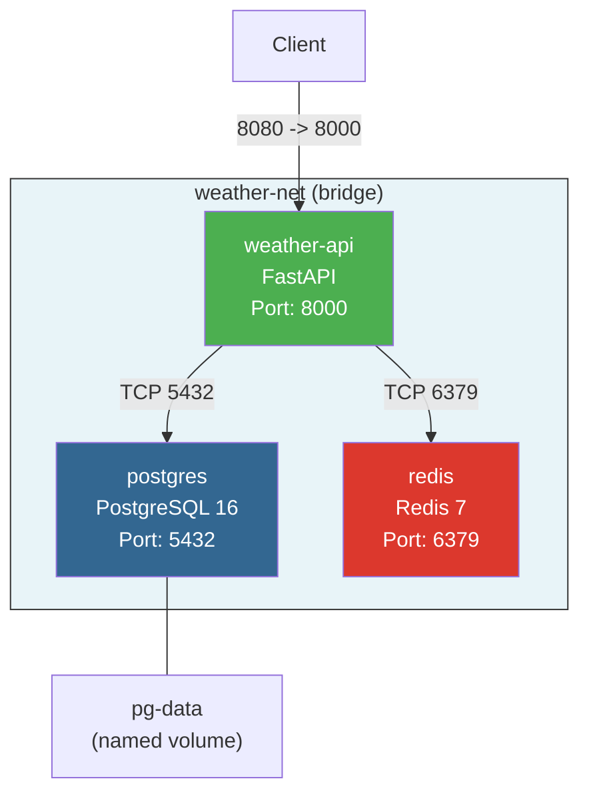

# Схема взаимодействия контейнеров

## Сетевая диаграмма

## Описание

Все сервисы объединены в изолированную Docker-сеть `weather-net` (bridge driver).

| Сервис | Внутренний порт | Внешний порт | Описание |
|--------|----------------|--------------|----------|
| weather-api | 8000 | 8080 | REST API - единственный сервис с внешним доступом |
| postgres | 5432 | - | БД - доступна только внутри сети |
| redis | 6379 | - | Кэш - доступен только внутри сети |

### Volumes

- `pg-data` - named volume для persistent storage данных PostgreSQL

### Безопасность сети

- PostgreSQL и Redis не имеют пробросов на хост
- Доступ к БД и кэшу возможен только из контейнеров внутри `weather-net`
- Пароли передаются через переменные окружения, не хранятся в образе
