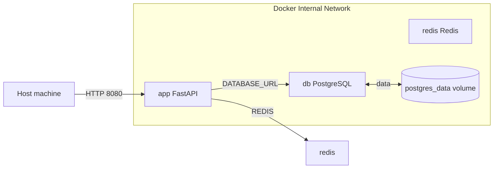

# Схема взаимодействия контейнеров

## Пояснение

- `app FastAPI` публикует наружу порт `8000`, поэтому API доступен с хост-машины.
- `redis` и `cache` работают во внутренней сети Docker и адресуются по именам сервисов `redis` и `cache`.
- Постоянные данные PostgreSQL сохраняются в named volume `postgres_data`.
- Настройки подключения передаются через переменные окружения, а не захардкожены.
