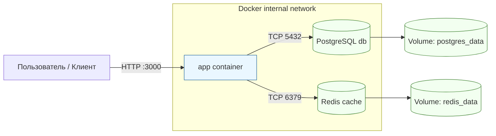

# Схема сетевого взаимодействия контейнеров

Ключевые принципы:

- Сервисы взаимодействуют по именам контейнеров (`db`, `cache`) через внутреннюю сеть.
- Наружу публикуется только порт приложения, БД и кэш изолированы.
- Данные PostgreSQL сохраняются в персистентном томе `postgres_data`.
