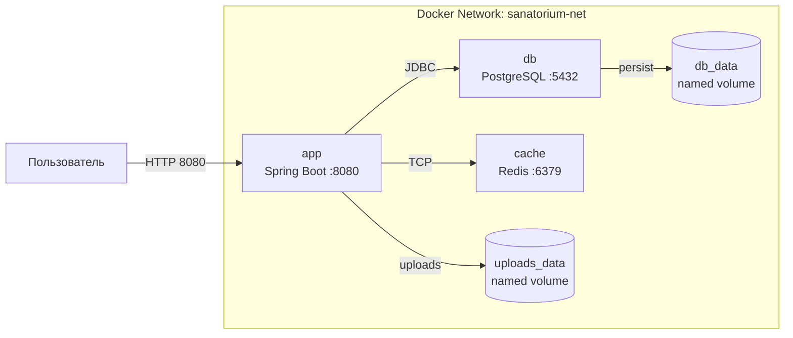

# Схема взаимодействия контейнеров

## Пояснение

- **app** — Spring Boot-приложение. Публикует порт `8080` на хост-машину для внешнего доступа.
- **db** — PostgreSQL 17 Alpine. Работает во внутренней сети, адресуются по имени сервиса `db`. Данные сохраняются в named volume `db_data`.
- **cache** — Redis 7 Alpine. Внутренняя сеть, адрес по имени `cache`. Используется для кэширования и инфраструктурной готовности.
- **sanatorium-net** — изолированная Docker-сеть (bridge). Все три сервиса находятся в одной сети и общаются по внутренним DNS-именам.
- **volumes** — `db_data` для персистентности PostgreSQL, `uploads_data` для загруженных изображений новостей.
- Настройки подключения передаются через переменные окружения.