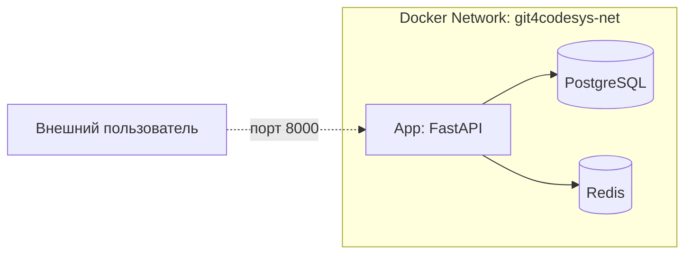

# Схема взаимодействия контейнеров

```mermaid
graph LR
    subgraph Docker Network: git4codesys-net
        A[App: FastAPI] --> B[(PostgreSQL)]
        A --> C[(Redis)]
    end
    D[Внешний пользователь] -.->|порт 8000| A
```

Все сервисы в изолированной сети `git4codesys-net`.  
App → db: `db:5432`, App → cache: `cache:6379`.  
Доступ извне только к порту `8000`.
