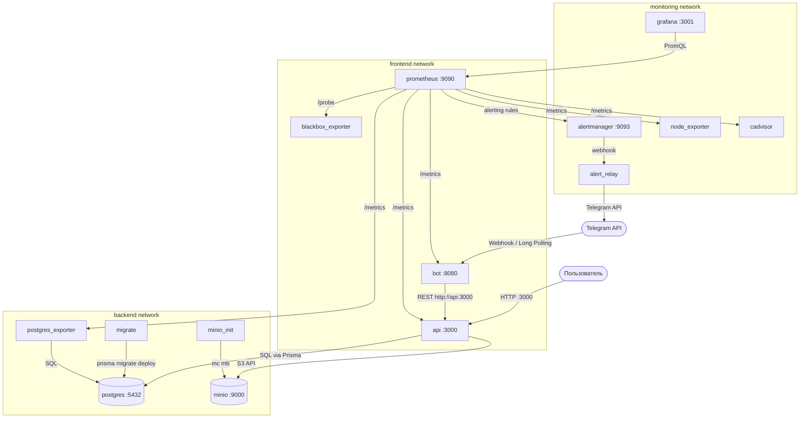

# Схема сетевого взаимодействия контейнеров

## Обзор

Инфраструктура разделена на три изолированные Docker-сети по принципу наименьших привилегий: каждый сервис имеет доступ только к тем сетям, которые необходимы для его работы.

## Сети

| Сеть | Driver | Назначение |
|------|--------|------------|
| **frontend** | bridge | Взаимодействие клиентских сервисов (API, Bot) с внешним миром и мониторингом |
| **backend** | bridge | Доступ к данным (PostgreSQL, MinIO) |
| **monitoring** | bridge | Сбор метрик и алертинг |

## Схема взаимодействия

## Принадлежность сервисов к сетям

| Сервис | frontend | backend | monitoring |
|--------|----------|---------|------------|
| api | ✅ | ✅ | — |
| bot | ✅ | ✅ | — |
| postgres | — | ✅ | — |
| minio | — | ✅ | — |
| minio_init | — | ✅ | — |
| migrate | — | ✅ | — |
| prometheus | ✅ | — | ✅ |
| grafana | — | — | ✅ |
| alertmanager | — | — | ✅ |
| alert_relay | — | — | ✅ |
| node_exporter | — | — | ✅ |
| postgres_exporter | — | ✅ | ✅ |
| cadvisor | — | — | ✅ |
| blackbox_exporter | ✅ | — | ✅ |

## Изоляция

- **PostgreSQL и MinIO** доступны только из `backend` — ни один внешний сервис не может обратиться к ним напрямую
- **Grafana и Alertmanager** живут в `monitoring` — доступ к дашбордам только через проброшенные порты на localhost
- **API** — единственный сервис с выходом в обе рабочие сети (`frontend` + `backend`)
- Все порты пробрасываются на `127.0.0.1` — недоступны извне без reverse proxy

## Volumes (Persistence)

| Volume | Сервис | Назначение |
|--------|--------|------------|
| `postgres_data` | postgres | Данные БД |
| `prometheus_data` | prometheus | Метрики (retention 30d / 5GB) |
| `grafana_data` | grafana | Дашборды и настройки |
| `alert_relay_data` | alert_relay | SQLite для дедупликации алертов |
| `minio_data` | minio | Объектное хранилище (чеки) |

## Health Checks

| Сервис | Проверка | Интервал |
|--------|----------|----------|
| postgres | `pg_isready` | 5s |
| api | `fetch('/healthz')` | 5s |
| bot | `fetch('/healthz')` | 30s |
| alert_relay | `fetch('/healthz')` | 30s |
| minio | `curl /minio/health/live` | 5s |

Зависимости настроены через `depends_on` с `condition: service_healthy` — сервисы стартуют только когда их зависимости готовы.

## Resource Limits

| Сервис | Memory Limit |
|--------|-------------|
| postgres | 512M |
| api | 512M |
| minio | 256M |
| bot, migrate, grafana, prometheus | 256M |
| alertmanager, cadvisor | 128M |
| alert_relay, node_exporter, blackbox_exporter, postgres_exporter | 64M |
