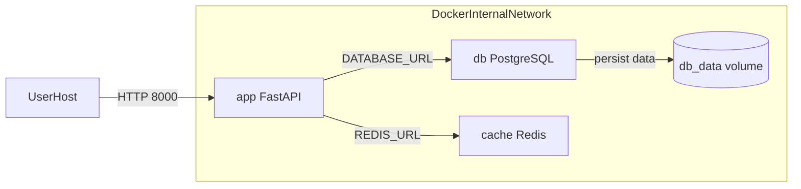

# Схема взаимодействия контейнеров

## Пояснение

- `app` публикует наружу порт `8000`, поэтому API доступен с хост-машины.
- `db` и `cache` работают во внутренней сети Docker и адресуются по именам сервисов `db` и `cache`.
- Постоянные данные PostgreSQL сохраняются в named volume `db_data`.
- Настройки подключения передаются через переменные окружения, а не захардкожены в коде.
