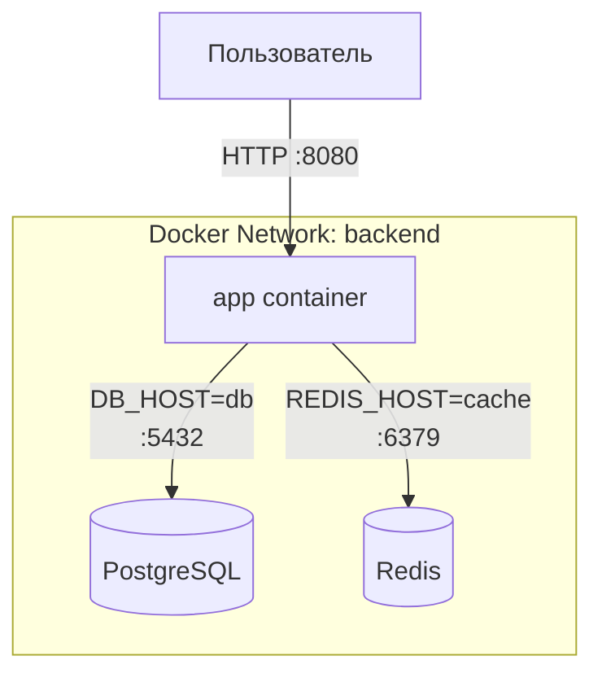

# Networking Schema

## Описание взаимодействия сервисов

В системе используются три контейнера:
- **app** — основное приложение (Go-сервер)
- **db** — база данных PostgreSQL
- **cache** — кэш Redis

Контейнеры объединены в одну внутреннюю сеть Docker (`backend`), что позволяет им взаимодействовать по именам сервисов.

---

## Схема взаимодействия

