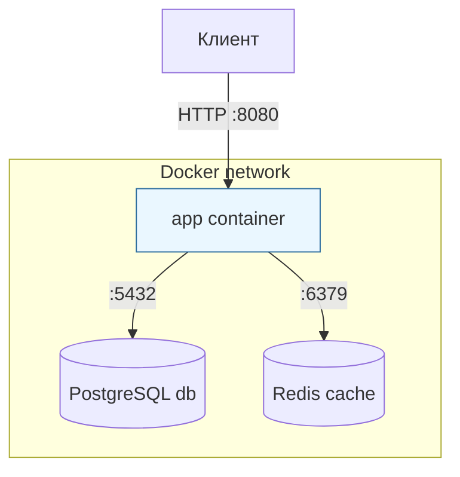

## Схема контейнеров

| Название контейнера | Описание |
|----------|----------|
| app container | Контейнер с ASP.Net Core |
| DB | Контейнер с PostgreSql |
| Cache | Контейнер с Redis |

```mermaid
flowchart TD
    User[Клиент] -->|HTTP :8080| App[app container]

    subgraph docker_net [Docker network]
        App -->|:5432|DB[(PostgreSQL db)]
        App -->|:6379|Cache[(Redis cache)]
    end

    classDef svc fill:#eaf7ff,stroke:#2f6f9f,stroke-width:1px;
    classDef data fill:#f2fff0,stroke:#4c8a3f,stroke-width:1px;

    class App svc;
    class DB, Cache;
```