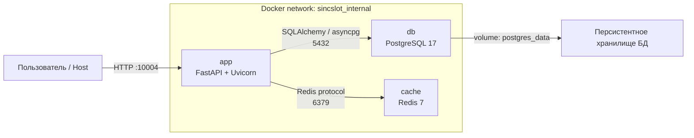

# Схема взаимодействия контейнеров

## Пояснение

- `app` доступен с хост-машины по порту `10004`;
- `db` и `cache` находятся во внутренней bridge-сети и общаются по сервисным DNS-именам `db` и `cache`;
- наружу публикуются только необходимые порты;
- данные PostgreSQL сохраняются в именованном volume `postgres_data`.
