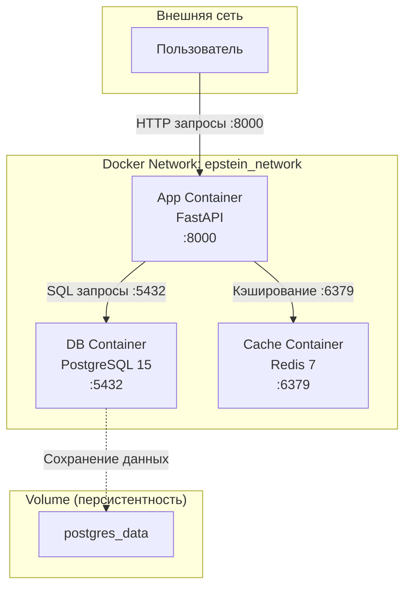

# Схема взаимодействия контейнеров

## Диаграмма

## Описание взаимодействия

1. **Пользователь** → отправляет HTTP-запросы на порт `8000`
2. **App Container** → принимает запросы, обрабатывает бизнес-логику
3. **App** → подключается к PostgreSQL для чтения/записи данных
4. **App** → использует Redis для кэширования частых запросов
5. **PostgreSQL** → сохраняет данные в volume (персистентность)

## Изоляция

Все три сервиса находятся в одной пользовательской сети `epstein_network`:
- Внутренняя изоляция от других контейнеров
- Доступ по именам сервисов (`db`, `cache`, `app`)
- Порты БД и Redis не публикуются наружу (только внутренние)